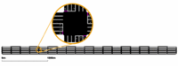

# 抽象的ネットワーク生成

[原文ページ](https://sumo.dlr.de/wiki/Networks/Abstract_Network_Generation)

[NETGENERATE]() は格子型、クモの巣型、ランダムの三種類の抽象的ネットワークを生成することができます。

作りたいネットワークのタイプは**--grid**,**--spider**,**--rand**のどれかで指定する必要があります。
生成するネットワークの名前は**--output `<ファイル名>`**か**-o `<ファイル名>`**で指定できます。
デフォルトでは"net.net.xml"になります。

!!! note "訳注"
    クモの巣型ネットワークは原文では"Spider"となっており直訳すると「クモ」ですが、見た目との対応を考えこの訳にしました。
 
## 格子型ネットワーク

X方向とY方向にどれだけの交差点を作るかと、各交差点間の距離を決めることができます。
交差点の数に関するパラメータは**--grid.x-number**と**--grid.y-number**であり、交差点同士の距離は**--grid.x-length**と**--grid.y-length**です。
どちらの軸にも同じ値を持つネットワークを作る場合は**--grid.number**と**--grid.length**を使ってください。
長さの単位はメートルです。
グリッドの端に道路を追加して全ての交差点が四つの道路を持つようにする**--grid.attach-length**というオプションもあります(X方向とY方向で別の長さの道路を添付するのは現在ではまだ不可能です)。

使い方の例は:

```
netgenerate --grid --grid.number=10 --grid.length=400 --output-file=MySUMOFile.net.xml
```

または:

```
netgenerate --grid --grid.x-number=20 --grid.y-number=5 \
 --grid.y-length=40 --grid.x-length=200 --output-file=MySUMOFile.net.xml
```

この呼びだしはそれぞれ以下のネットワークを生成します。




## クモ型ネットワーク

クモ型ネットワークは分割軸の数(パラメータ **--spider.arm-number** または **--arms**、デフォルトは13)、同心円の数(**--spider.circle-number** または **--circle**、デフォルトは20)そして同心円同士の距離(**--spider.space-radius** または **--radius**、単位はメートルでデフォルトは100)です。

!!! cautions "警告"
    クモの巣の中心のエッジ数(中心の点に接続されている枝の数)は膨大になることがあり、しばしば信号付き交差点を生成することが不可能になります。
    したがって、この交差点は常に統制のとれていない状態になります。

オプションとして**--spider.omit-center** または **--nocenter**を使うことで中心の交差点を削除することができます。
このオプションは円周のネットワークを構築する簡単な方法にもなります。

例えば

```
netgenerate --spider --spider.omit-center --output-file=MySUMOFile.net.xml
```

は13個の要素からなる半径100mの円を生成します。


使用例として:

```
netgenerate --spider --spider.arm-number=10 --spider.circle-number=10 \
 --spider.space-radius=100 --output-file=MySUMOFile.net.xml
```
と:

```
netgenerate --spider --spider.arm-number=4 --spider.circle-number=3 \
 --spider.space-radius=100 --output-file=MySUMOFile.net.xml
```

はそれぞれ以下のネットワークを生成します。


## ランダムネットワーク

ランダムネットワーク生成器はその名のとおり、ランダムなネットワークを生成します。
いくつかの設定があります。

* **--rand.iterations** `<INT>`
* **--rand.bidi-probability** `<FLOAT>`: 逆方向の枝が生成される確率
* **--rand.max-distance** `<FLOAT>`: 枝の最大長さ
* **--rand.min-distance** `<FLOAT>`: 枝の最小長さ
* **--rand.min-angle** `<FLOAT>`: 二つの枝の最小角度
* **--rand.num-tries** `<INT>`
* **--rand.num-connectivity** `<FLOAT>`:
* **--rand.neighbor-dist1** `<FLOAT>`:
* **--rand.neighbor-dist2** `<FLOAT>`:
* **--rand.neighbor-dist3** `<FLOAT>`:
* **--rand.neighbor-dist4** `<FLOAT>`:
* **--rand.neighbor-dist5** `<FLOAT>`:
* **--rand.neighbor-dist6** `<FLOAT>`:

例として:

```
netgenerate --rand -o MySUMOFile.net.xml --rand.iterations=200
```

は以下のネットワークを生成します。


## さらなるオプション

抽象的ネットワークはいくつかコマンドラインオプションを共有しています。
全てのネットワークは接点(交差点)を持つため、接点のタイプを**--default-junction-type-option**(または**-j**)を使って指定することができます。 
次の交差点タイプがシミュレーションによって許可されています: priority, traffic_light

さらには、[NETCONVERT]()アプリケーションで同じオプションを使うことで、道路の標準形を設定することができます。