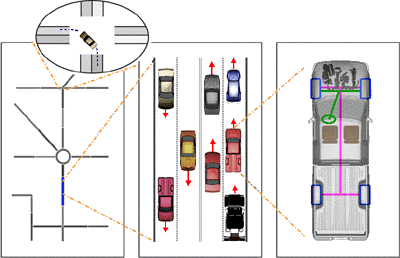
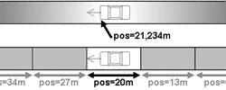

# 理論/一般的な交通シミュレーション

[原文ページ](https://sumo.dlr.de/wiki/Theory/Traffic_Simulations)

## 交通シミュレーションクラス

交通に関する研究においては、シミュレーションの詳細に応じて4つの交通流モデルが考えられます。
「巨視的」モデルでは交通流は基本的な存在です。
「微視的」モデルでは道路の個々の車の動きをシミュレートします。
ほとんどの場合、車の動きは車自身の物理性能と運転手の振舞いに依存することが仮定されています([ChowdhurySantenSchadschneider2000]()を参照)。
SUMOでは、Stefan Kraußによって作られた微視的モデルにいくつか仮定を加えたものが使われています([Krauss1998_1]()、[Krauss1998_2]()を参照)。
中視的(Mesoscopic)シミュレーションは微視的シミュレーションと巨視的シミュレーションの境界に位置しています。
ここでは、自動車の動きはほとんど「キュー」方式でシミュレートされ、個々の自動車はそうしたキューの間を動いていきます。
超微視的モデルは微視的モデルと同じように一台の自動車を扱いますが、それらをより基礎部分にまで拡張します(例: 車の速度をエンジンの回転数や運転手の選んだギアとの関係で表現する)。
このことによって単純な微視的モデルよりも詳細な計算が可能になります。
しかし、超微視的モデルはより計算時間を必要とするため、シミュレーションできるネットワークのサイズに制限がかかることになります。

**画像: シミュレーション粒度 左から右に、巨視的、微視的、超微視的(円は中視的)**

連続空間シミュレーションでは、個々の車は浮動小数で表わされる位置を持っています。
対照的に、離散空間シミュレーションはセルオートマトンです。
道路はセルに分割され、車はシミュレートされた道路で一つのセルからもう一つに「飛び移るように」移動していきます。

殆ど全てのシミュレーションパッケージは自身の持つ車の行動モデルを利用します。
ほとんど全てのモデルはいわゆる「追従モデル」と呼ばれるものです。
運転手の振舞いは運転手の前の車との距離および前の車の速度に依存していることを仮定するモデルです。

## ユーザーの割りあて

運転手一人一人がネットワーク中の最短距離を使おうとするのは明らかなように見えますが、全ての運転手がそうすると

この問題の解決法は交通研究の分野では「ユーザー割り当て」と呼ばれています。

解決にはいくつかのアプローチが可能であり、SUMOでは Christian Gawron によって開発された「動的ユーザー割り当て」(dynamic user assignment: DUA) を使います([Gawron1998_1]()を参照)。